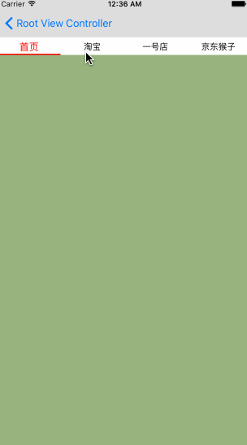
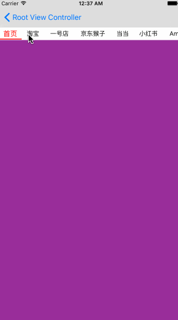

### A scrollable segment control and controller.





## Usage

```objective-c
// extend DDScrollSegmentViewController, override viewDidLoad
self.items = @[@"首页",@"淘宝",@"一号店",@"京东猴子"];
self.controllers = @[...];
self.segmentControl.itemWidth = CGRectGetWidth([UIScreen mainScreen].bounds)/self.items.count;
// or
[self setAutoSizeItems];
```

## LISENCE

MIT